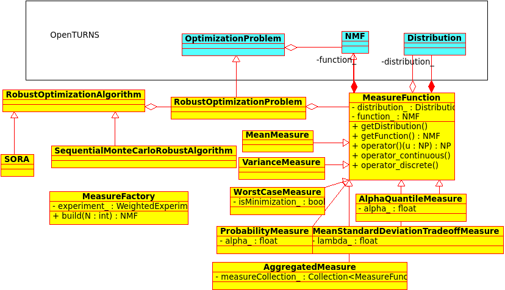

Architecture considerations
===========================

Dependencies
------------

Several dependencies are needed in order to build:

 - OpenTURNS
 - Sphinx-doc (optional for this doc)

Compilation
-----------

.. code-block:: bash

    cd otrobopt
    mkdir -p build && cd build
    cmake \
      -DCMAKE_INSTALL_PREFIX=$PWD/install \
      -DOpenTURNS_DIR=$PWD/../../openturns/build/install/lib/cmake/openturns \
      ..

Source code structure
---------------------

Here is the global class diagram for each layer:

